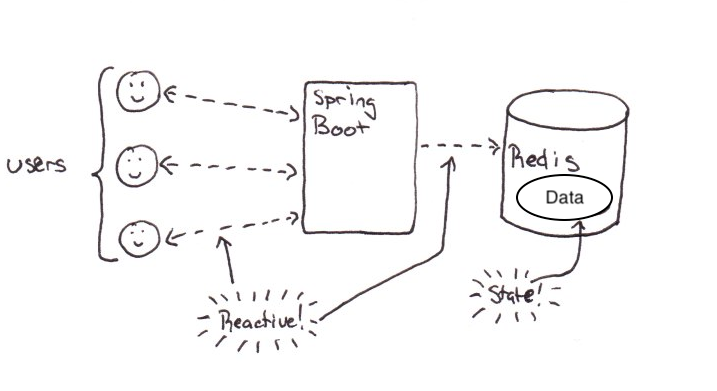

# 리액티브 시스템 체험
우리는 리액티브 시스템이 현대적인 아키텍처를 구성하는 많이 사용된다고 자주 들어왔습니다.<br>
짧게 구성된 이번 실습을 통해 리액티브 어플리케이션을 구현할 수 있도록 하는 리액티브 프로그래밍이 어떤 식으로 동작하는지 살펴보고자 합니다.<br>
이를 위해 아래와 같이 데이저 저장소로 Redis를 사용하며 이를 접근하기 위한 백엔드 어플리케이션을 Spring Boot으로 구동시켜보고자 합니다.<br>

Spring Boot 어플리케이션 내에는 [<u>```Spring Data Redis```</u>](https://projects.spring.io/spring-data-redis/) 라이브러리를 통해 Redis 저장소에 Reactive하게 접근하며, 이는 [<u>```Project Reactor```</u>](https://projectreactor.io/), [<u>```Netty```</u>](https://netty.io/) 및 이에 기반한 [<u>```WebFlux```</u>](https://docs.spring.io/spring-framework/reference/web/webflux.html)를 포함하고 있습니다.<br>
위에서 해당 링크를 클릭하여 각각에 대한 자세한 내용을 더 살펴보실 수 있습니다.<br>



> (참고)<br>
> 아래 링크는 ```Reactive Manifesto```와 AWS 서비스 사이의 관계를 설명하는 백서입니다.
> - https://docs.aws.amazon.com/whitepapers/latest/reactive-systems-on-aws/the-reactive-manifesto-and-aws-services.html

# 분산 트랜잭션 오케스트레이션 (Saga)
AwsomePets라고 하는 전자 상거래 시스템을 위한 Saga Orchestration 패턴의 구현을 실습합니다. Saga 패턴은 각 트랜잭션이 단일 서비스 내에서 데이터를 업데이트하는 일련의 로컬 트랜잭션입니다. Saga 오케스트레이션은 이러한 로컬 트랜잭션 묶음을 조정하기 위해 단일 오케스트레이터를 사용합니다. 이 시스템은 API Gateway, AWS Lambda, Amazon DynamoDB 및 AWS Step Functions을 사용하여 구현되었고, AWS Step Functions를 사가 오케스트레이터로 사용합니다.

우리는 SAM (Serverless Application Model)을 사용하여 서비스를 배포할 것입니다. SAM에 대한 사항을 자세히 다루지 않을 것이며 이에 대한 자세한 내용을 보려면 [[여기]](https://docs.aws.amazon.com/serverless-application-model/latest/developerguide/what-is-sam.html)를 클릭하십시오. Lambda 함수의 소스 코드도 포함되어 배포됩니다.<br>

빌드할 전체 아키텍처는 다음과 같습니다.


주문 트랜잭션 프로세스는 다음 작업을 수행합니다.

1. 브라우저 클라이언트가 HTTP를 통해 주문을 제출하면 새 주문을 생성하는 주문 프로세스를 시작합니다.<br>
2. 브라우저에 웹 소켓 URL을 반환하면 브라우저가 후속 웹 소켓 연결을 열어 주문 상태 업데이트를 수신할 준비를 합니다.<br>
3. 백엔드에서는 방금 제출된 주문에 대해 브라우저 웹 소켓 연결을 등록합니다.<br>
4. 주문 오케스트레이터 워크플로를 시작합니다.<br>
5. 인벤토리에서 주문 항목을 예약합니다.<br>
6. 신용 카드 결제를 처리합니다.<br>
7. 주문 상태를 '완료 (completed)'로 설정하여 주문 프로세스를 완료합니다.<br>
8. 웹 소켓 연결을 통해 클라이언트에게 주문 상태 업데이트를 알립니다.

우리는 다음과 같은 서비스를 사용할 것입니다:<br>

## Amazon API Gateway
Amazon API Gateway는 개발자가 API를 생성, 게시, 유지 관리, 모니터링 및 보호할 수 있는 AWS 서비스입니다. AWS 클라우드에 저장된 데이터뿐만 아니라 AWS 또는 기타 웹 서비스에 액세스하는 API를 생성할 수 있습니다. API 게이트웨이는 클라우드에서 AWS 서비스와 기타 공개 또는 비공개 웹 사이트를 연결하는 백플레인으로 간주될 수 있습니다. 모바일 및 웹 애플리케이션이 AWS 서비스에 액세스할 수 있도록 일관된 RESTful 애플리케이션 프로그래밍 인터페이스(API)를 제공합니다. Amazon API Gateway에 대한 자세한 내용을 보려면 [[여기]](https://aws.amazon.com/apigateway/)를 클릭하십시오.

## AWS Lambda
AWS Lambda는 서버 프로비저닝 또는 관리, 워크로드 클러스터의 확장 논리, 이벤트 통합 유지 또는 런타임 관리 없이 코드를 실행할 수 있는 서버리스 컴퓨팅 서비스입니다. Lambda를 사용하면 관리 없이 거의 모든 유형의 애플리케이션 또는 백엔드 서비스에 대한 코드를 실행할 수 있습니다. AWS Lambda에 대한 자세한 내용을 보려면 [[여기]](https://aws.amazon.com/lambda/)를 클릭하십시오.

## AWS Step Functions
AWS Step Functions는 AWS Lambda 함수와 여러 AWS 서비스를 비즈니스 크리티컬 애플리케이션으로 쉽게 시퀀싱할 수 있는 서버리스 함수 오케스트레이터입니다. 시각적 인터페이스를 통해 애플리케이션 상태를 유지 관리하는 일련의 체크포인트 및 이벤트 기반 워크플로를 만들고 실행할 수 있습니다. 한 단계의 출력은 다음 단계의 입력 역할을 합니다. 애플리케이션의 각 단계는 비즈니스 논리에 정의된 대로 순서대로 실행됩니다. AWS Step Functions에 대한 자세한 내용을 보려면 [[여기]](https://aws.amazon.com/step-functions/)를 클릭하십시오.

## AWS DynamoDB
Amazon DynamoDB는 모든 규모에서 한 자릿수 밀리초의 성능을 제공하는 키-값 및 문서 데이터베이스입니다. 내장된 보안, 백업 및 복원, 인터넷 규모 애플리케이션을 위한 메모리 내 캐싱을 갖춘 완전 관리형, 다중 리전, 다중 활성, 내구성 있는 데이터베이스입니다. DynamoDB는 하루에 10조 개 이상의 요청을 처리할 수 있으며 초당 최대 2천만 개 이상의 요청을 지원할 수 있습니다. Amazon DynamoDB에 대한 자세한 내용을 보려면 [[여기]](https://aws.amazon.com/dynamodb/)를 클릭하십시오.

---

# 작업 환경 (Cloud9) 설정
현대적 아키텍처 실습을 진행하기에 앞서 우선 작업 환경으로 쓰일 Cloud9에 대한 환경 설정을 진행합니다.<br>
[](common/docs/cloud9.md)

# 실습 1 - 리액티브 어플리케이션 맛보기
이 실습에서는 현대적인 시스템 구축에 있어 기본적인 프로그래밍 패러다임이 되고 있는 리액티브 프로그래밍 기법을 Spring Boot과 Redis를 활용하여 간단하게 살펴보도록 하겠습니다.<br>

아래 순서로 진행됩니다.
1. [반응형 어플리케이션 인프라 구성](./lab1-reactive-application/docs/1-reactive-application-infrastructure.md)
2. [Tool 설정 및 반응형 어플리케이션 소스 코드 내려받기](./lab1-reactive-application/docs/2-tooling-and-cloning-application-source-code.md)
3. [빌드, 실행 및 로컬 테스트](./lab1-reactive-application/docs/3-build-run-local-test.md)
4. [AWS 관리형 레디스를 통한 테스트](./lab1-reactive-application/docs/4-test-with-aws-easticache-for-redis.md)

[](lab1-reactive-application/docs/1-reactive-application-infrastructure.md "Lab 1")
<br></br>


# 실습 2 - 분산 트랜잭션 실습

이번 실습은 아래와 같은 순서로 진행될 예정입니다.
1. [현대적 아키텍처 실습 환경 설치](./lab2-saga/docs/1-install-serverless-infrastructure.md)
2. [API Gateway 웹 소켓 설정](./lab2-saga/docs/2-configure-api-gateway-websocket.md)
3. [프론트엔드 S3 호스팅 설치](./lab2-saga/docs/3-install-s3-hosting.md)
4. [AWSomePets 어플리케이션 둘러보기](./lab2-saga/docs/4-navigate-awsomepets-application.md)
5. [주문 생성 프로세스](./lab2-saga/docs/5-create-order-process.md)<br>
   1. [주문 생성 REST API](./lab2-saga/docs/5.1-create-order-rest-api.md)
   2. [주문 생성 람다 함수](./lab2-saga/docs/5.2-CreateOrderFunction-lambda.md)
6. [콜백 마이크로서비스 둘러보기](./lab2-saga/docs/6-explore-callback-microservices.md)
7. [Step Functions 둘러보기](./lab2-saga/docs/7-explore-step-functions.md)
   1. [성공 트랜잭션 흐름](./lab2-saga/docs/7.1-aws-step-functions-success-transaction-flow.md)
   2. [실패 보상 트랜잭션 흐름](./lab2-saga/docs/7.2-aws-step-functions-compensating-transaction-flow.md)
8. [웹 소켓 콜백 둘러보기](./lab2-saga/docs/8-explore-websocket-callback.md)
   1. [API Gateway 웹 소켓 API](./lab2-saga/docs/8.1-explore-api-gateway-websocket-api.md)
   2. [웹 소켓 콜백 람다](./lab2-saga/docs/8.2-explore-websocket-callback-lambda-function.md)
9. [(도전 과제) 배송비 계산 기능 추가](./lab2-saga/docs/9-challenge-calculate-shipping-cost.md)


[](lab2-saga/docs/1-install-serverless-infrastructure.md "Lab 2")
<br></br>
