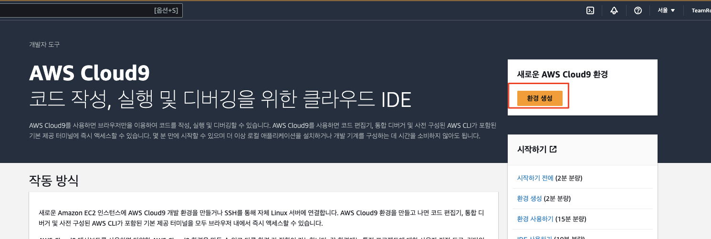
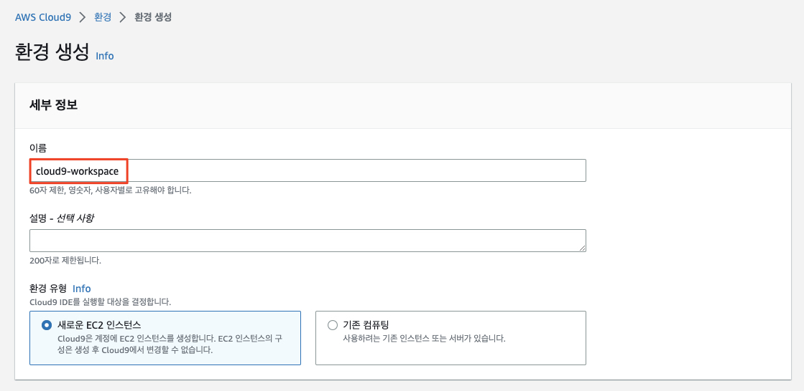
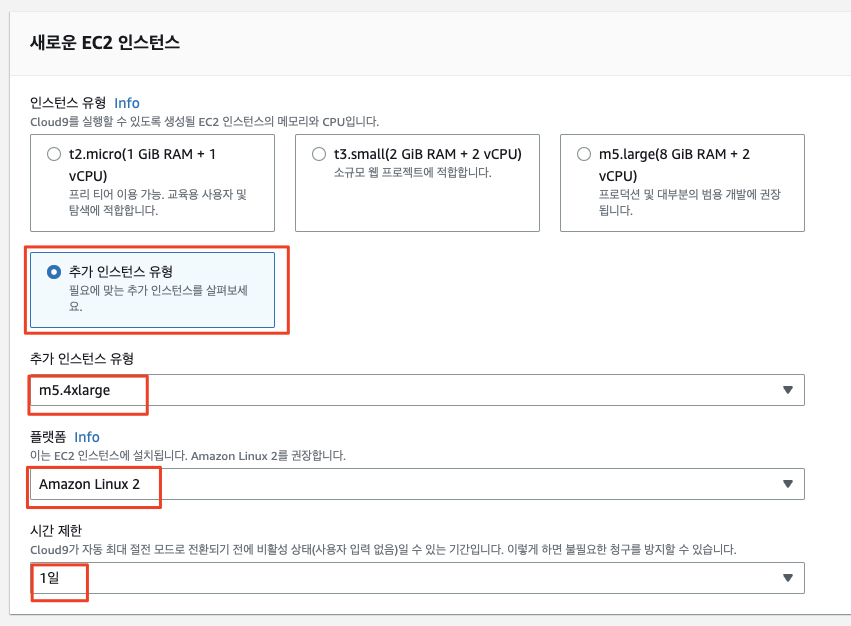
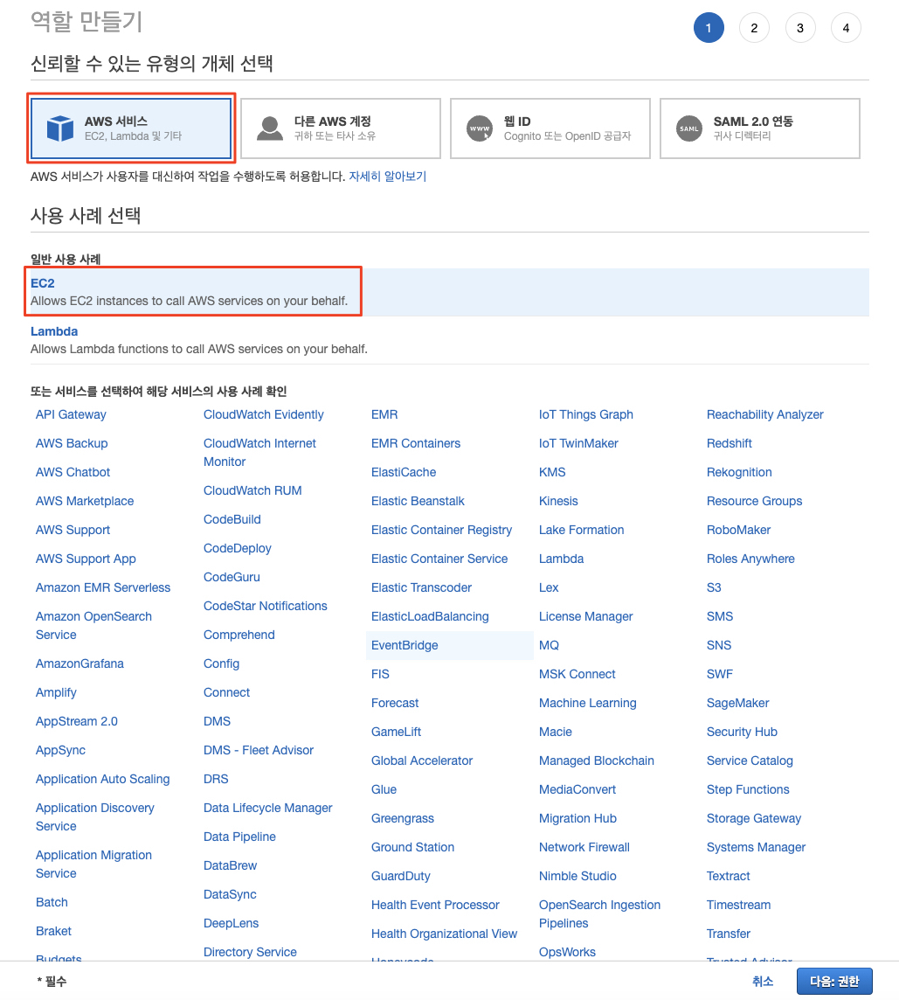
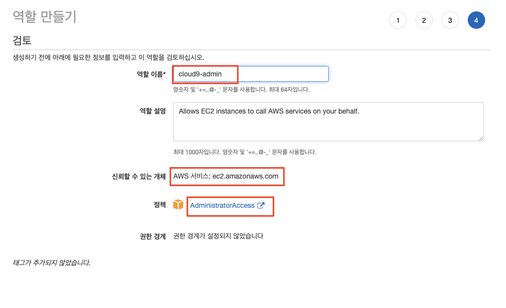
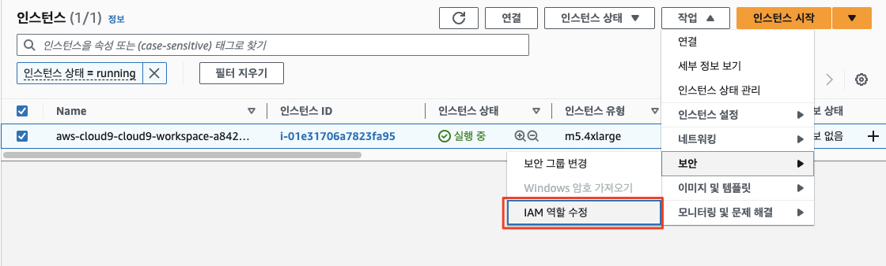
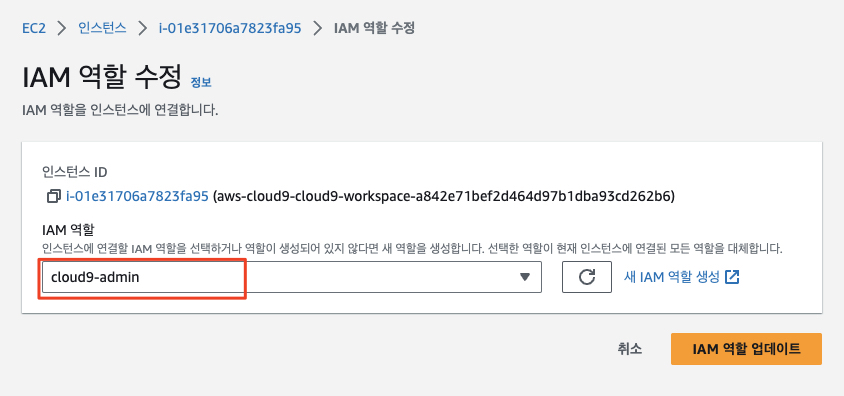
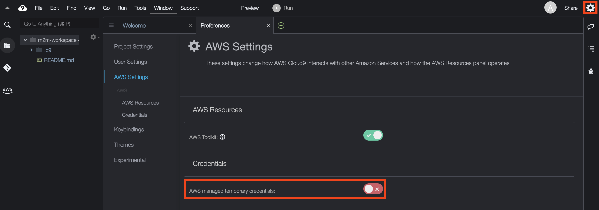

# Cloud9 환경 구성하기

IDE로 Cloud9을 사용하기 위해서 Cloud9 환경을 시작하고, 각종 도구들을 설치합니다.

## Agenda

1. Cloud9 시작하기
    * 1.1. AWS Cloud9 IDE 구성
    * 1.2. IAM Role 생성
    * 1.3. IDE(AWS Cloud9 인스턴스)에 IAM Role 부여
    * 1.4. IDE에서 IAM 설정 업데이트
2. (Amazon EKS 사용 시에만) EKS 관련 도구 설치
    * 2.1. kubectl 설치
    * 2.2. eksctl 설치
    * 2.3. k9s 설치
    * 2.4. Helm 설치
3. AWS CLI 업데이트
4. AWS CDK 업그레이드
5. 기타 도구 설치 및 구성
    * 5.1. AWS SSM 세션 매니저 플러그인 설치
    * 5.2. AWS Cloud9 CLI 설치
    * 5.3. jq 설치하기
    * 5.4. bash-completion 설치하기
    * 5.5. Cloud9 추가 설정하기
    * 5.6. 디스크 증설

## 1. Cloud9 시작하기

AWS Cloud9으로 실습 환경을 구축하는 순서는 아래와 같습니다.

- AWS Cloud9으로 IDE 구성
- IAM Role 생성
- IDE(AWS Cloud9 인스턴스)에 IAM Role 부여
- IDE에서 IAM 설정 업데이트

### 1.1 AWS Cloud9으로 IDE 구성

1. [AWS Cloud9 콘솔창](https://console.aws.amazon.com/cloud9)에 접속한 후, ```환경 생성 (Create environment)``` 버튼을 클릭합니다.<br>
   
2. ```세부 정보 (Details)```에서 이름을 다음과 같이 cloud9-workspace으로 입력합니다.
   ```
   cloud9-workspace
   ```
   
   


[//]: # (3. &#40;중요&#41; "Network settings"에서 앞서 EKS 클러스터 생성 과정에서 함께 생성된 VPC 및 Subnet을 선택한다. 이는 이후에 생성할 데이터베이스에 접속하여 구성하는 작업을 함께 수행하기 위함이다.)

[//]: # (  - VPC: EKS 클러스터 생성 시 함께 생성된 VPC)

[//]: # (  - Subnet: PrivateSubnet-a <br>)

[//]: # (![Cloud9 생성 화면]&#40;./assets/cloud9-network-settings.png&#41;)

3. New EC2 Instance에서 인스턴스 타입 (Instance Type)으로 ```추가 인스턴스 유형``` > ```m5.4xlarge (16vCPU + 64GiB RAM)```를 선택합니다. 플랫폼 (Platform)은 "Amazon Linux 2"를 선택하고 Timeout은 "1 Day"를 선택한 후 하단의 Create를 클릭하여 생성합니다. 나머지는 기본값을 그대로 사용합니다.

   

### 1.2. IAM Role 생성

IAM Role은 특정 권한을 가진 IAM 자격 증명입니다. IAM 역할의 경우, IAM 사용자 및 AWS가 제공하는 서비스에 사용할 수 있습니다. 서비스에 IAM Role을 부여할 경우, 서비스가 사용자를 대신하여 수임받은 역할을 수행합니다.

본 실습에서는 Administrator access 정책을 가진 IAM Role을 생성하여 AWS Cloud9에 사용하지만, 실제 프로덕션 환경을 구동할 때에는 최소 권한을 부여하는 것이 적합합니다.

1. [여기](https://console.aws.amazon.com/iam/home#/roles$new?step=type&commonUseCase=EC2%2BEC2&selectedUseCase=EC2&policies=arn:aws:iam::aws:policy%2FAdministratorAccess)를 클릭하여 IAM Role 생성 페이지에 접속합니다.<br>

   

2. AWS Service 및 EC2가 선택된 것을 확인하고 Next: Permissions를 클릭합니다.
3. AdministratorAccess 정책이 선택된 것을 확인하고 Next: Tags를 클릭합니다.
4. 태그 추가(선택 사항) 단계에서 Next: Review를 클릭합니다.
5. Role name에 아래와 같이 cloud9-admin을 입력한 후, AdministratorAccess 관리형 정책이 추가된 것을 확인하고 Create role을 클릭합니다. (참고) Role 이름은 조금씩 다르게 지어도 되지만 기록해 두시면 좋습니다.
   ```
   cloud9-admin
   ```
   
   


### 1.3. IDE (AWS Cloud9 인스턴스)에 IAM Role 부여

AWS Cloud9 환경은 EC2 인스턴스로 구동됩니다. 따라서 EC2 콘솔에서 AWS Cloud9 인스턴스에 방금 생성한 IAM Role을 부여합니다.

1. [여기](https://console.aws.amazon.com/ec2/v2/home?#Instances:sort=desc:launchTime)를 클릭하여 EC2 인스턴스 페이지에 접속합니다.
2. 해당 인스턴스를 선택 후, ```작업 (Actions) > 보안 (Security) > IAM 역할 수정 (Modify IAM Role)```을 클릭합니다 (참고: 설정된 언어에 따라 동일한 의미를 가지는 다른 언어로 표시될 수 있습니다).<br>
   
3. IAM Role에서 cloud9-admin을 선택한 후, Save 버튼을 클릭합니다.<br>
    > (참고) 여기에 표시되는 화면은 실제로 설정하고 있는 환경과 조금씩 다를 수 있습니다.<br>

    

### 1.4. IDE에서 IAM 설정 업데이트

기본적으로 AWS Cloud9는 IAM 인증 정보 (Credentials)를 동적으로 관리합니다. 해당 인증 정보는 Cloud9 환경을 생성한 Principal의 권한을 상속받아서 필요한 권한이 없을 수 있으며 15분마다 갱신되므로 긴 수행 시간을 가지는 작업의 경우에는 인증 토큰이 만료됨에 따라 실패할 수도 있습니다. 따라서 이를 비활성화하고 앞서 생성한 IAM Role을 Cloud9 환경에 부여하고자 합니다.

- AWS Cloud9 콘솔창에서 생성한 IDE로 다시 접속한 후, 우측 상단에 기어 아이콘을 클릭한 후, 사이드 바에서 "AWS Settings"를 클릭합니다.
- Credentials 항목에서 AWS managed temporary credentials 설정을 비활성화합니다.<br>
  
- Preference tab을 종료합니다.
- Temporary credentials이 없는지 확실히 하기 위해 기존의 자격 증명 파일도 제거합니다.

```bash
rm -vf ${HOME}/.aws/credentials
```

- GetCallerIdentity CLI 명령어를 통해, Cloud9 IDE가 올바른 IAM Role을 사용하고 있는지 확인하세요. 결과 값이 나오면 올바르게 설정된 것입니다.

```bash
aws sts get-caller-identity --query Arn | grep cloud9-admin
```

## 2. (Amazon EKS 사용 시에만) EKS 관련 도구 설치

### 2.1. kubectl 설치

kubectl은 쿠버네티스 클러스터에 명령을 내리는 CLI입니다.

쿠버네티스는 오브젝트 생성, 수정 혹은 삭제와 관련한 동작을 수행하기 위해 쿠버네티스 API를 사용합니다. 이때, kubectl CLI를 사용하면 해당 명령어가 쿠버네티스 API를 호출해 관련 동작을 수행합니다.

아래 명령을 통해 kubectl을 설치할 수 있으며 자세한 사항은 아래 사이트를 참고할 수 있습니다.
- [Installing kubectl for Amazon EKS](https://docs.aws.amazon.com/eks/latest/userguide/install-kubectl.htmle)

```bash
# 설치
sudo curl -o /usr/local/bin/kubectl  \
   https://s3.us-west-2.amazonaws.com/amazon-eks/1.27.1/2023-04-19/bin/linux/amd64/kubectl
```

```bash
# 실행 모드 변경
sudo chmod +x /usr/local/bin/kubectl
```

```bash
# 확인
kubectl version --short --client
```

### 2.1. eksctl 설치

[eksctl](https://eksctl.io/)이란 EKS 클러스터를 쉽게 생성 및 관리하는 CLI 툴입니다. Go 언어로 쓰여 있으며 CloudFormation 형태로 배포됩니다. 아래의 명령어를 통해, 최신의 eksctl 바이너리를 다운로드 합니다.
> (참고) 우리는 이번 핸즈온에서는 eksctl을 적극적으로 사용하지 않을 것이지만 사용이 필요할 수 있으므로 설치해 두기로 합니다.

```bash
# 설치
curl --silent --location "https://github.com/weaveworks/eksctl/releases/latest/download/eksctl_$(uname -s)_amd64.tar.gz" | tar xz -C /tmp
```

```bash
# 이동
sudo mv -v /tmp/eksctl /usr/local/bin
```

```bash
# 확인
eksctl version
```

### 2.3. k9s 설치하기
```bash
curl -sL https://github.com/derailed/k9s/releases/download/v0.27.4/k9s_Linux_amd64.tar.gz | sudo tar xfz - -C /usr/local/bin
```

### 2.4. Helm 설치 ([참고: helm 설치](https://helm.sh/docs/intro/install/))
```bash
curl -fsSL https://raw.githubusercontent.com/helm/helm/main/scripts/get-helm-3 | bash
helm version --short
```

## 3. AWS CLI 업데이트
Cloud9에 설치된 AWS CLI의 버전이 1일 경우 kubectl과의 연계에 문제가 있을 수 있습니다. 이를 해소하기 위해 AWS CLI를 업데이트합니다.<br>
> (참고) aws --version 명령을 실행했을 때 다음과 같이 표시되면 AWS CLI Version 1 환경입니다.<br>
>
> ```bash
> aws --version
> ```
> (버전 1 표시 예)<br>
> $ aws-cli/1.19.112 Python/2.7.18 Linux/4.14.314-237.533.amzn2.x86_64 botocore/1.20.112

Cloud9의 터미널 창에서 다음을 실행합니다.

```bash
# 1. AWS CLI Version 1 삭제
sudo rm /usr/bin/aws
sudo rm /usr/bin/aws_completer
sudo rm -rf /usr/local/aws-cli
```

```bash
# 2. AWS CLI Version 2 설치
curl "https://awscli.amazonaws.com/awscli-exe-linux-x86_64.zip" -o "awscliv2.zip"
unzip awscliv2.zip
sudo ./aws/install
hash -d aws
aws --version
```
> aws-cli/2.11.22 Python/3.11.3 Linux/4.14.314-237.533.amzn2.x86_64 exe/x86_64.amzn.2 prompt/off

## 4. (AWS CDK를 사용하는 경우) AWS CDK 업그레이드
AWS CDK는 CloudFormation을 보다 고차원적으로 포장하여 자원을 정의하고 배포할 수 있는 IaC 도구입니다.<br>

```bash
# Upgrade CDK
npm uninstall -g aws-cdk
rm -rf $(which cdk)
npm install -g aws-cdk
cdk --version
```

## 5. 기타 도구 설치 및 구성

실습 진행에 도움이 되는 도구들을 설치하고 구성합니다.

### 5.1. AWS SSM 세션 매니저 플러그인 설치
AWS SSM 세션 매니저는 EC2 인스턴스에 SSH 키 없이 접속하고자 할 때 필요합니다.

```bash
curl "https://s3.amazonaws.com/session-manager-downloads/plugin/latest/linux_64bit/session-manager-plugin.rpm" -o "session-manager-plugin.rpm"
sudo yum install -y session-manager-plugin.rpm
```

### 5.2. AWS Cloud9 CLI 설치
Cloud9 환경을 CLI로 다루기 위한 도구입니다.

```bash
npm install -g c9
```

### 5.3. jq 설치하기

jq는 JSON 형식의 데이터를 다루는 커맨드라인 유틸리티입니다. 아래의 명령어를 통해, jq를 설치합니다.

```bash
sudo yum install -y jq
```

### 5.4. bash-completion 설치하기

Bash 쉘에서 kubectl completion script는 kubectl completion bash 명령어를 통해 생성할 수 있습니다. 쉘에 completion script를 소싱하면 kubectl 명령어의 자동 완성을 가능하게 만들 수 있습니다. 하지만 이런 completion script는 bash-completion에 의존하기 때문에 아래의 명령어를 통해, [bash-completion](https://github.com/scop/bash-completion#installation)을 설치해야 합니다.

```bash
sudo yum install -y bash-completion
```

## 5.5. Cloud9 추가 설정하기

현재 실습이 진행되고 있는 리전을 기본값으로 하도록 aws cli를 설정합니다.

```bash
# 설정
export AWS_REGION=$(curl -s 169.254.169.254/latest/dynamic/instance-identity/document | jq -r '.region')

echo "export AWS_REGION=${AWS_REGION}" | tee -a ~/.bash_profile

aws configure set default.region ${AWS_REGION}

# 확인
aws configure get default.region
```

현재 실습을 진행하는 계정 ID를 환경 변수로 등록합니다.

```bash
export ACCOUNT_ID=$(curl -s 169.254.169.254/latest/dynamic/instance-identity/document | jq -r '.accountId')

echo "export ACCOUNT_ID=${ACCOUNT_ID}" | tee -a ~/.bash_profile
```

### 5.6. 디스크 증설
도커 이미지를 빌드하는 동안, AWS Cloud9 환경에서 용량 부족 이슈가 발생할 수 있습니다. 이를 해결하기 위해, 디스크를 증설하는 쉘 스크립트를 실행합니다.

```bash
# 다운로드 및 실행
curl -fsSL https://raw.githubusercontent.com/shkim4u/kubernetes-misc/main/aws-cloud9/resize.sh | bash
df -h
```

## 실습 가이드 및 소스 리포지터리 받기 (git clone)
```bash
cd ~/environment

git clone https://github.com/shkim4u/modern-architecture.git
cd modern-architecture
```
