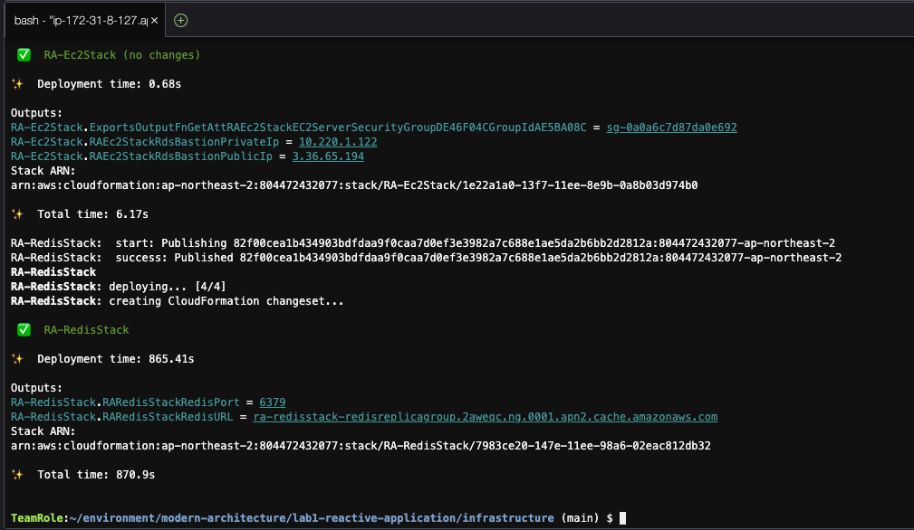

# 리액티브 시스템 인프라스트럭처 구성

리액티브 시스템을 체험해 볼 수 있도록 간단한 인프라스트럭처 구성 요소를 배포해 보도록 하겠습니다.<br>

해당 구성 요소는 AWS CDK를 통하여 작성해 보았으며, 아래와 같은 자원이 생성될 것입니다.

1. Amazon VPC
   1. 자원이 생성될 VPC, 서브넷, Internet Gateway, NAT Gateway 등 네트워크 구성 요소가 생성됩니다.
2. Amazon EC
   1. 리액티브 어플리케이션이 빌드되고 실행될 백엔드 서버입니다.
3. Amazon ElastiCache for Redis
   1. 데이터를 캐시 구조에 저장하는 관리형 인 메모리 데이터 스토어입니다.
   2. 데이터 입출력은 리액티브한 아키텍처 구성에 있어 가장 큰 걸림돌이 될 수 있는데 Redis의 데이터 조회를 어떻게 리액티브하게 구성할 수 있으며, 이를 통해 얻는 시스템 차원의 잇점을 살펴볼 수 있습니다.

## AWS CDK를 사용하여 자원 생성

아래 명령어를 통해 실습에 필요한 자원을 배포합니다. 10 ~ 20분 정도 소요됩니다.<br>

```bash
# 1. IaC 디렉토리로 이동
cd ~/environment/modern-architecture/lab1-reactive-application/infrastructure

# 2. npm install pakcage dependencies
npm install

# 3. AWS CDK bootstrapping
cdk bootstrapping

# 4. CDK synthesize & deploy
# Will be calling [cdk synth && cdk deploy --all --outputs-file ./cdk-outputs.json --require-approval=never] internally
npm run deploy
```
배포가 진행되는 동안에 우리가 무엇을 배포하고 있는지 잠깐 살펴보도록 하겠습니다.<br>
<br>
1. Network Stack: EC2 인스턴스 및 Redis 클러스터 자원이 위치할 VPC, 서브넷, Internet Gateway, NAT Gateway와 같은 네트워크 구성 요소를 생성합니다.
2. EC2 Stack: 리액티브 어플리케이션을 호스팅하는 EC2 인스턴스를 생성합니다.
3. IAM Stack: EC2 인스턴스가 수임(Assume)할 Role, Permission을 정의하고 생성합니다.
4. Redis Stack: 간단한 데이터 구조를 인 메모리 구조로 저장하고 조회하는 캐시 서비스 클러스터입니다.

배포가 성공적으로 완료되면 아래와 같이 표시됩니다.<br>


강사와 함께 CDK 소스 코드 및 이로부터 생성된 자원을 좀 더 둘러보도록 합니다.

---

## [[이전]](../../README.md) | [[다음]](2-tooling-and-cloning-application-source-code.md)
