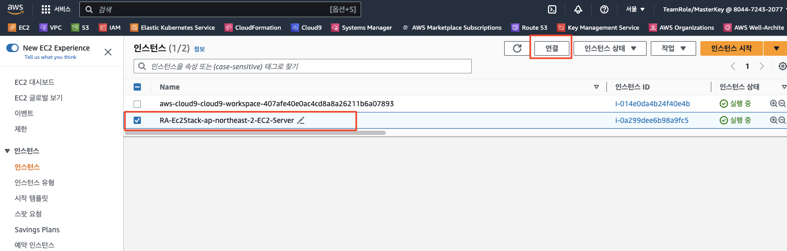
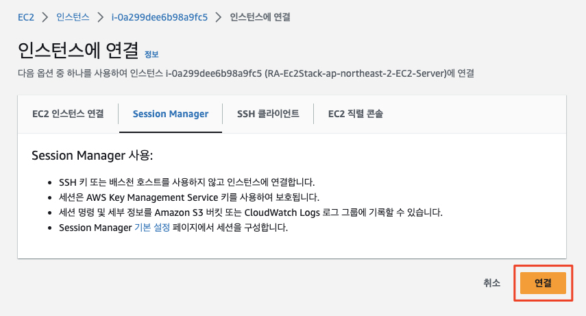
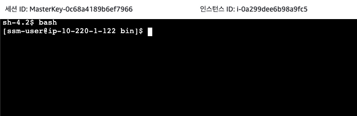
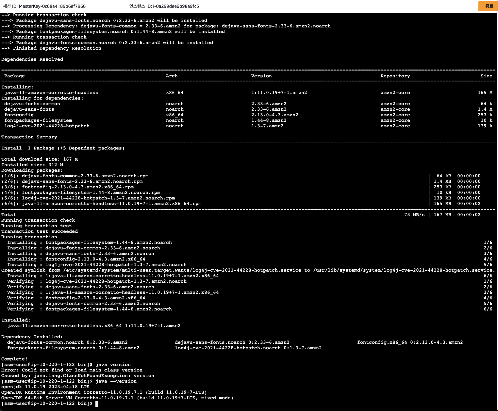
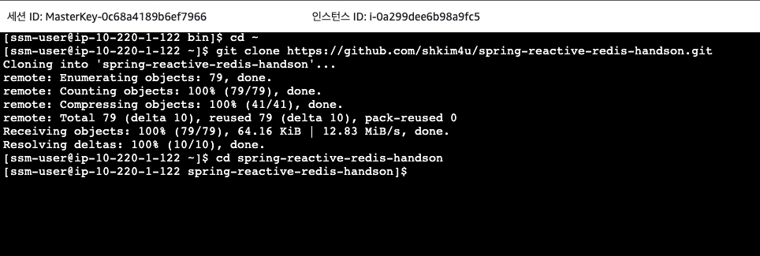

# 서버 (EC2) 접속, Tooling (자바) 및 소스 받기

이제 리액티브 어플리케이션을 호스팅하는 서버 (EC2 인스턴스)에 접속하고 어플리케이션을 빌드하는데 필요한 Tool을 설정하도록 하겠습니다. 그런 후 소스를 내려받고 (git clone) 빌드한 후 실행시켜 보도록 하겠습니다.

> (참고)<br>
> 이후 작업은 Cloud9이 아닌 CDK로 생성된 EC2 인스턴스에서 수행하도록 합니다.

## 서버 (EC2 인스턴스) 접속
1. ```AWS 콘솔 > EC2 서비스 > 인스턴스```로 이동 후 세션 매니저를 사용하여 ```RA-Ec2Stack-ap-northeast-2-EC2-Server```로 이름 지어진 인스턴스에 접속합니다.<br>

    <br>
    <br>
    <br>

## Tooling 설치 및 구성
아래 명령어를 실행하여 Java 런타임을 설치합니다.
> (참고)<br>
> 아래에 설치되는 Amazon Corretto 자바 배포판은 현재 가장 많이 사용되는 자바 개발 및 런타임으로 등극하였습니다.<br>
> - 출처: https://devclass.com/2023/05/02/amazon-now-the-most-popular-java-development-kit-vendor-for-production-according-to-observability-survey/

```bash
sudo yum update -y
sudo yum install -y git
sudo yum install -y java-11-amazon-corretto-headless

java --version
```


## 리액티브 어플리케이션 소스 받기
아래와 같이 실행하여 리액티브 어플리케이션 소스를 받습니다.<br>

```bash
cd ~
git clone https://github.com/shkim4u/spring-reactive-redis-handson.git
cd spring-reactive-redis-handson
```



이제 소스를 빌드하고 리액티브 어플리케이션을 체험할 준비가 되었습니다.

---

## [[이전]](1-reactive-application-infrastructure.md) | [[다음]](3-build-run-local-test.md)
