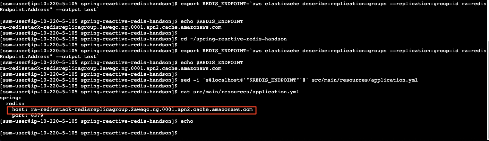
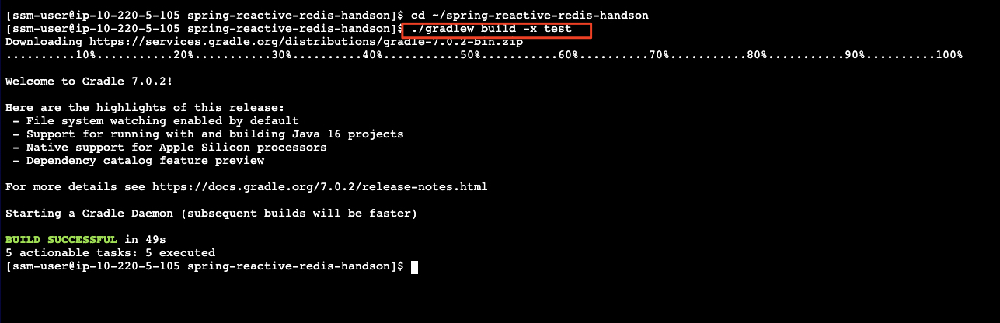
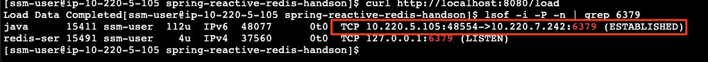
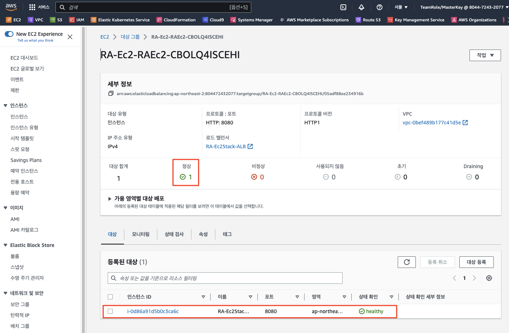
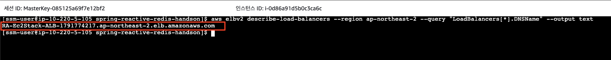
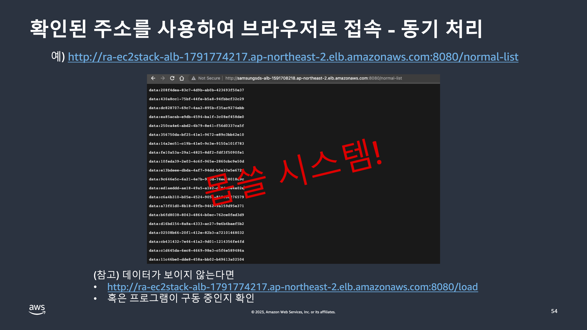
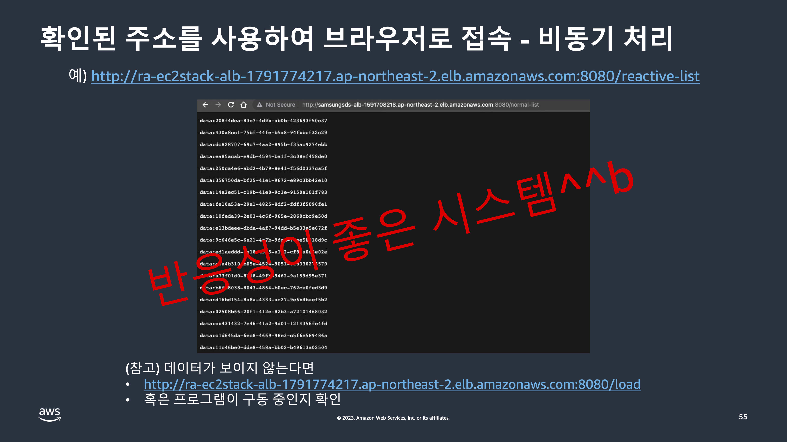

# Amazon ElastiCache for Redis를 대상으로 테스트

우리는 앞서 로컬에서 내장 레디스 서버를 사용하여 데이터에 대한 조회 요청을 리액티브하게 처리하는 과정을 살펴보았습니다.

여기에서 한발 더 나아가 AWS가 제공하는 Managed Service인 ```Amazon ElastiCache for Reds```를 대상으로 동일한 테스트를 수행해 보도록 하겠습니다.

이미 리액티브 어플리케이션의 동작 원리는 살펴보았으므로, 이번에는 AWS에서 관리형 Redis 서버를 체험해 보는 취지로 둘러보시면 좋을 것 같습니다.


## Amazon ElastiCache for Redis 클러스터 엔드포인트 확인
앞서 우리는 CDK로 자원을 배포하는 과정에서 레디스 클러스터도 함께 생성되었습니다.

생성된 레디스 클러스터의 엔드포인트는 아래 위치에서 확인할 수 있습니다.
1. 콘솔에서 ```ElastiCache > Redis 클러스터 > ra-redisstack-redisreplicagroup```로 이동<br>
    

    > (참고)<br>
      해당 엔드포인트는 CDK를 통해 생성된 CloudFormation 스택의 출력 탭에서도 확인 가능합니다.<br>
      

2. (옵션) 혹은 아래와 같이 AWS CLI를 통해서도 확인 가능합니다.
    ```bash
    aws elasticache describe-replication-groups \
        --replication-group-id ra-redisstack-redisreplicagroup \
        --region ap-northeast-2 \
        --query "ReplicationGroups[].NodeGroups[].PrimaryEndpoint.Address" --output text
    ```
    
    

## 어플리케이션 수정 - 레디스 엔드포인트
vi 에디터를 사용하여 어플리케이션 설정 파일의 레디스 엔드포인트를 실제 서버의 그것으로 변경합니다. 혹은 아래와 같이 ```sed``` 유틸리트를 사용하여 파일의 내용을 단일 명령으로 수정합니다.<br>
```bash
cd ~/spring-reactive-redis-handson

export REDIS_ENDPOINT=`aws elasticache describe-replication-groups --replication-group-id ra-redisstack-redisreplicagroup --region ap-northeast-2 --query "ReplicationGroups[].NodeGroups[].PrimaryEndpoint.Address" --output text`
echo $REDIS_ENDPOINT

sed -i 's@localhost@'"$REDIS_ENDPOINT"'@' src/main/resources/application.yml

cat src/main/resources/application.yml
echo
```


## 어플리케이션 (재)빌드
```bash
cd ~/spring-reactive-redis-handson
./gradlew build -x test
```


## 리액티브 어플리케이션 실행

```bash
cd ~/spring-reactive-redis-handson

# 프로그램 실행
nohup java -XX:+HeapDumpOnOutOfMemoryError -Duser.timezone=Asia/Seoul -jar build/libs/spring-reactive-redis-handson-0.0.1-SNAPSHOT.jar &
```

```bash
# 실행 확인
lsof -i -P -n | grep 8080
```

[//]: # (```bash)

[//]: # (# 레디스 클러스터 접속 확인)

[//]: # (lsof -i -P -n | grep 6379)

[//]: # (```)


## 테스트
이제 AWS의 관리형 레디스 클러스터에 데이터를 적재하고 이를 Reactive하게 조회하는 기능을 테스트할 준비가 끝났습니다.<br>

1. 10만 개의 테스트 데이터 적재
```bash
curl http://localhost:8080/load
```


> (참고)<br>
> 위 명령을 수행하면 원격 레디스 클러스터에 접속한 후 10만개의 데이터를 메모리 캐시에 적재합니다.<br>
> 그리고 아래 그림과 같이 원격 레디스 클러스터에 접속한 상태를 확인할 수 있습니다.<br><br>


2. AWS 콘솔에서 ```EC2 > 대상 그룹 > RA-Ec2-XXX``` 이름을 가진 대상 그룹의 상태가 ```Healthy```임을 확인합니다.


3. 아래 명령으로 Application Load Balancer의 DNS 이름을 확인합니다.
```bash
aws elbv2 describe-load-balancers --region ap-northeast-2 --query "LoadBalancers[*].DNSName" --output text
```


4. (전통적인 방식의 동기 방식으로 호출) 위에서 확인한 Application Load Balancer의 DNS 이름을 사용하여 브라우저에서 다음 주소를 접근해 봅니다.
```
http://<위에서 확인한 ALB의 DNS 이름>/normal-list
```
> (참고)<br>
> 동기 호출의 단점을 체험하기 위해 새탭이나 새창을 열어 실행해 봅니다.



5. (리액티브/비동기 방식으로 호출) 위에서 확인한 Application Load Balancer의 DNS 이름을 사용하여 브라우저에서 다음 주소를 접근해 봅니다.
```bash
http://<위에서 확인한 ALB의 DNS 이름>/reactive-list
```
> (참고)<br>
> 차이를 체험하기 위하여 새탭이나 새창을 열어 실행해 봅니다.




위 4와 5의 차이가 느껴지시나요?!

## 성능 비교

사용자 경험의 극명한 차이 외에도 리액티브하게 호출함으로써 성능 측면에서의 개선도 꾀할 수 있습니다.

아래는 전통적인 동기적인 호출과 리액티브 호출의 응답 시간 차이를 보여줍니다.

1. 동기 호출 방식 (전체 호출 시간 예시)<br>
```bash
time curl http://localhost:8080/normal-list
```


2. 리액티스/비동기 호출 방식 (전체 호출 시간 예시)<br>
```bash
time curl http://localhost:8080/reactive-list
```


이러한 차이가 생기는 원인은 아마 쉽게 직관적으로 짐작하실 수 있으리라 생각됩니다.<br>

즉, 리액트브하게 구현된 동작은, 동기적 호출에서 10만개의 데이터가 레디스로부터 백엔드 서버로 적재되는 동안에 기다리는 시간 낭비 없이, 모든 데이터가 비동기적으로 준비되어 필요할 때만 메시지 스트림으로 호출자에게 바로 바로 Back-feeding되기 때문일 것입니다.

---

> **이로써 AWS의 관리형 레디스 서버를 사용하여 리액티브 어플리케이션을 체험해 보았습니다.<br>**
> 전체 어플리케이션 호출 흐름의 모든 부분을 리액티브하게 전환하는 것은 쉬운 일이 아니며 많은 고민과 노력이 필요한 작업입니다.<br>
> 하지만, 마이크로서비스와 같은 여러 시스템을 연계할 필요가 있거나, 리버스 프록시와 같은 요청 라우터를 구현할 필요가 있을 경우에는 반드시 염두에 두어야 할 개발 패러다임임을 기억해 주시면 감사하겠습니다.

---

### 이것으로 리액티브 어플리케이션 체험을 마치도록 하겠습니다. 생소할 수도 있는 내용인데 구성해 보시느라 수고하셨습니다!

