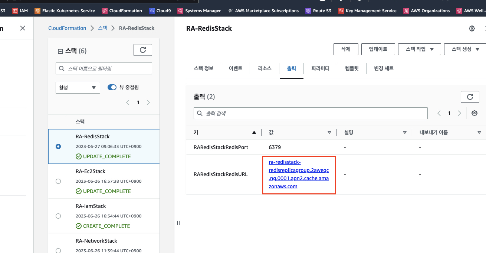
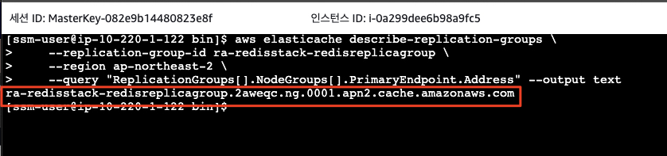

# Amazon ElastiCache for Redis를 대상으로 테스트

우리는 앞서 로컬에서 내장 레디스 서버를 사용하여 데이터에 대한 조회 요청을 리액티브하게 처리하는 과정을 살펴보았습니다.

여기에서 한발 더 나아가 AWS가 제공하는 Managed Service인 ```Amazon ElastiCache for Reds```를 대상으로 동일한 테스트를 수행해 보도록 하겠습니다.

이미 리액티브 어플리케이션의 동작 원리는 살펴보았으므로, 이번에는 AWS에서 관리형 Redis 서버를 체험해 보는 취지로 둘러보시면 좋을 것 같습니다.


## Amazon ElastiCache for Redis 클러스터 엔드포인트 확인
앞서 우리는 CDK로 자원을 배포하는 과정에서 레디스 클러스터도 함께 생성되었습니다.

생성된 레디스 클러스터의 엔드포인트는 아래 위치에서 확인할 수 있습니다.
1. 콘솔에서 ```ElastiCache > Redis 클러스터 > ra-redisstack-redisreplicagroup```로 이동<br>
    

    > (참고)<br>
      해당 엔드포인트는 CDK를 통해 생성된 CloudFormation 스택의 출력 탭에서도 확인 가능합니다.<br>
      

2. (옵션) 혹은 아래와 같이 AWS CLI를 통해서도 확인 가능합니다.
    ```bash
    aws elasticache describe-replication-groups \
        --replication-group-id ra-redisstack-redisreplicagroup \
        --region ap-northeast-2 \
        --query "ReplicationGroups[].NodeGroups[].PrimaryEndpoint.Address" --output text
    ```
    
    
