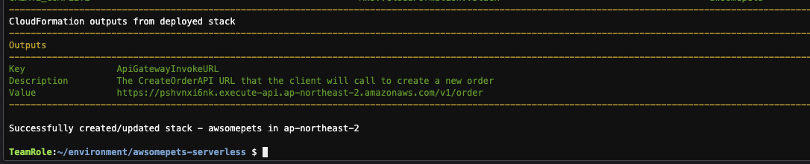

# AWSOMEPETS 서버리스 인프라 설치

이 섹션에서는 SAM (Serverless Application Model)을 사용하여 AWSomePets 샘플 애플리케이션을 설치합니다. AWS CLI 도구를 사용하여 서버 측 인프라와 애플리케이션의 웹 호스팅 사이트 역할을 하는 S3를 설정할 예정입니다.<br>
서버 측 인프라 설정을 먼저 살펴보겠습니다.

## 환경
1. 다음 명령을 실행하여 파일을 다운로드하고 압축을 풉니다.
```bash
cd ~/environment
curl -fsSL https://github.com/shkim4u/modern-architecture/raw/main/resources/lab2-saga/awsomepets-serverless.zip -o awsomepets-serverless.zip

unzip awsomepets-serverless.zip
cd awsomepets-serverless
```

2. 명령 프롬프트에 다음 명령을 입력하고 빌드가 완료될 때까지 기다립니다.
```bash
sam build
```

3. 그런 다음 명령 프롬프트에 다음 명령을 입력합니다.
```bash
sam deploy --guided
```

4. 배포에 필요한 구성 값을 입력하라는 메시지가 표시됩니다. 필요한 매개변수에 대해 아래 값을 사용하십시오. 기본값이나 빈값을 사용하려면 Enter를 누르시면 됩니다.<br>
```bash
Stack Name [sam-app]: awsomepets<br>
AWS Region [ap-northeast-2]: <br>
Parameter StageName [v1]:<br> 
Confirm changes before deploy [y/N]: y<br>
Allow SAM CLI IAM role creation [Y/n]: y<br>
Save arguments to configuration file [Y/n]: y<br>
SAM configuration file [samconfig.toml]:<br>
SAM configuration environment [default]:<br>
---------------------------------------------
Deploy this changeset? [y/N]: y
```

5. AWS 환경 설정이 완료되면 다음 CloudFormation 출력이 표시됩니다.<br>


6. 이제 다음 서비스를 배포했습니다.
   - Amazon API Gateway REST API - 주문 제출용 REST API.
   - Amazon API Gateway Websocket API - 주문 상태 업데이트를 수신하기 위한 Websocket API.
   - AWS Step Function - Lambda 함수를 실행하고 Saga 트랜잭션을 시퀀싱하는 Orchestrator.
   - AWS Lambda - 트랜잭션 로직을 실행하기 위해 코드를 실행하는 서버리스 컴퓨팅
   - DynamoDB tables - 주문, 재고, 결제 등과 같은 도메인 데이터를 저장하는 테이블
   - IAM 역할 (Role), 정책 (Policy) 및 권한 (Permission) - 서비스 권한 및 액세스를 관리하기 위한 역할, 정책 및 권한.

---

## [[이전]](../../README.md) | [[다음]](2-configure-api-gateway-websocket.md)
