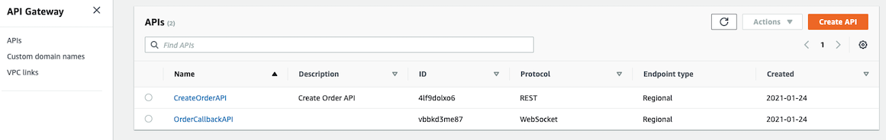
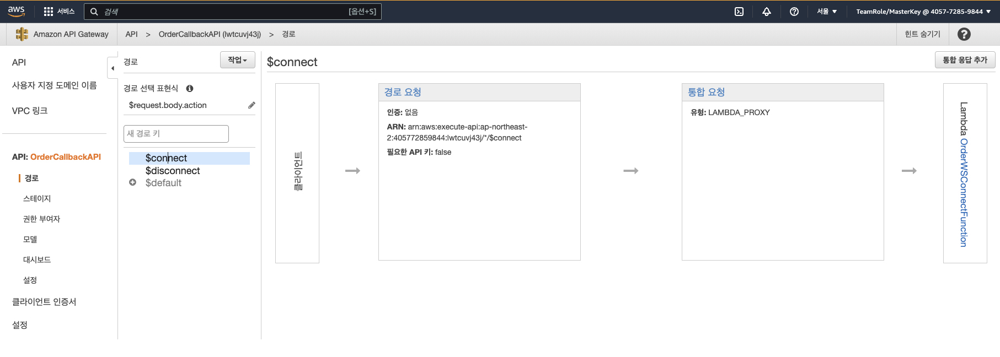
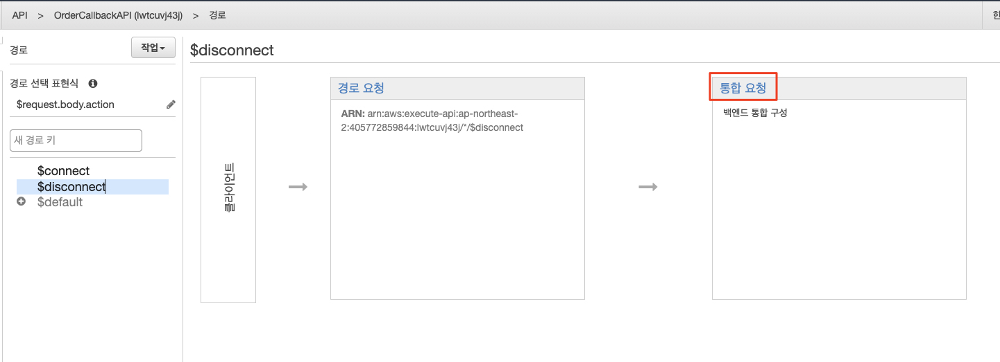
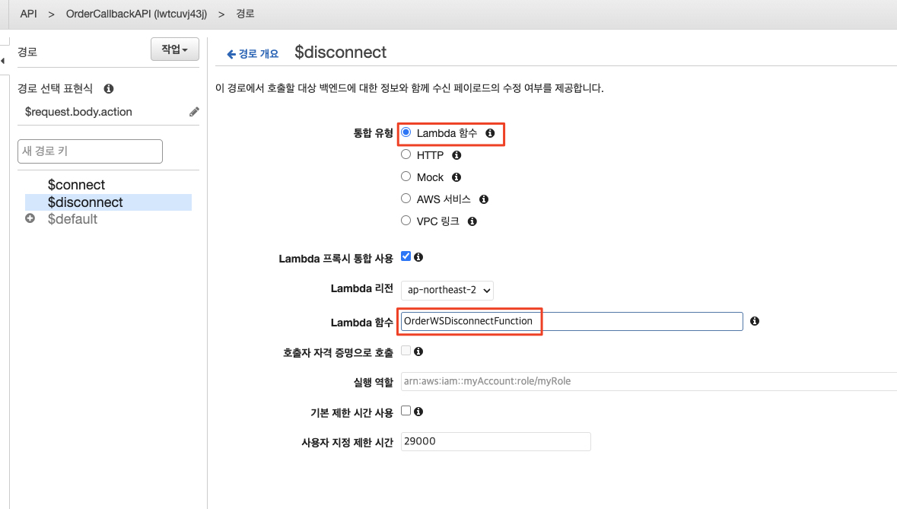
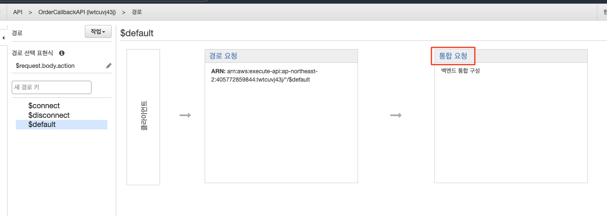
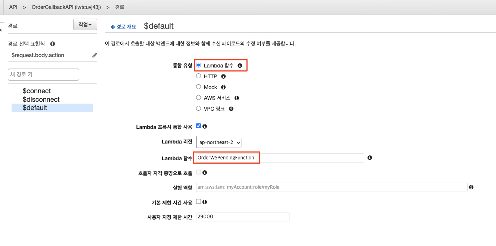
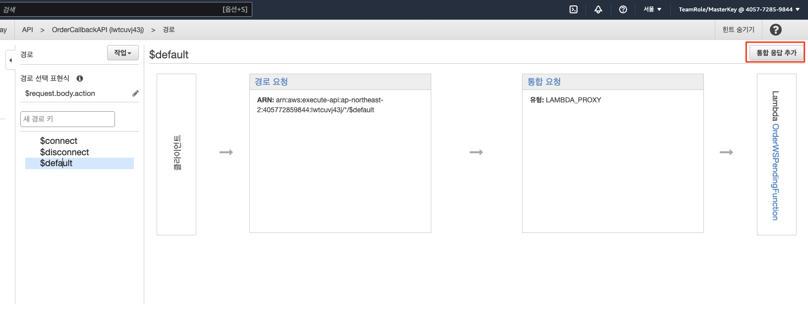
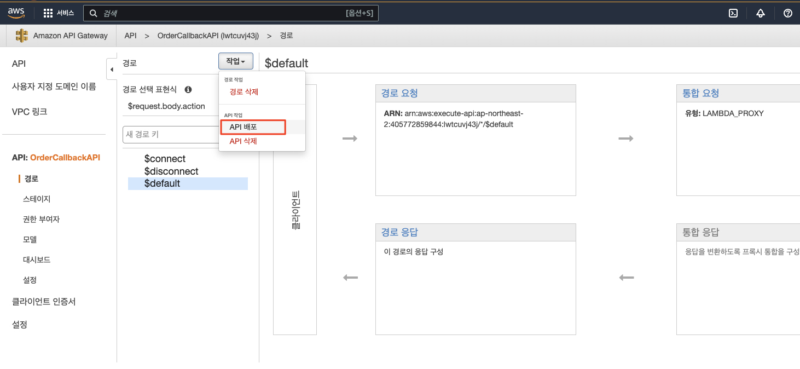
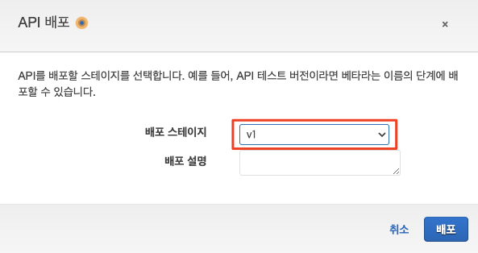

# API Gateway 웹 소켓 설정

API Gateway의 ```$disconnect``` 및 ```default``` 경로에 대한 웹 소켓 연결을 구성합니다. AWSomePets 애플리케이션은 웹 소켓을 활용하여 클라이언트와 백엔드 서비스 간의 양방향 연결을 생성하므로 클라이언트는 API 게이트웨이에서 API를 오랫동안 Polling하지 않고도 업데이트를 받을 수 있습니다. 긴 폴링의 단점은 API 게이트웨이를 과도하게 호출하여 추가 비용이 발생하고 잠재적으로 서비스 거부 공격을 유발할 수 있다는 것입니다. 웹 소켓은 단일 TCP 연결을 통해 전이중 (Full-duplex) 통신을 제공합니다.


## API Gateway 웹 소켓 살펴보기
1. AWS 콘솔에서 API Gateway 서비스로 이동하고 ```OrderCallbackAPI```를 클릭합니다.<br>


2. 그런 다음 ```경로 (Routes)``` 섹션을 선택하여 다양한 API 경로를 봅니다. 3개의 경로는 ```$connect```, ```$disconnect``` 및 ```$default```입니다.<br>


3. `````$connect````` 경로를 선택합니다. 이것은 클라이언트가 웹 소켓 연결을 요청할 때 호출되는 첫 번째 경로입니다. 클라이언트 요청을 받아 람다 함수 ```OrderWSConnectFunction```을 호출합니다. ```OrderWSConnectFunction```은 클라이언트가 상태 업데이트를 수신하려는 주문에 대해 DynamoDB 테이블에 레코드를 생성하여 연결을 등록합니다.<br>


## ```$disconnect``` 경로 설정하기

4. ```$disconnect``` 경로를 선택한 후 통합 세부 정보를 엽니다. 이는 클라이언트가 웹 소켓 연결을 끊을 때 호출되는 경로입니다. 경로가 현재 구성되어 있지 않으므로, ```통합 요청 (Integration Request)``` 링크를 클릭하여 백엔드 통합을 구성합니다.<br>


5. 통합 구성 화면으로 이동합니다. ```통합 유형 (Integration Type)``` 옵션으로 Lambda 함수를 선택하고 Lambda 함수 텍스트 상자에서 ```OrderWSDisconnectFunction```을 선택합니다. 다른 모든 값은 그대로 둡니다. 저장 버튼을 클릭합니다. 람다 함수에 권한이 추가됨을 나타내는 메시지가 표시되면, ```확인 (Ok)```을 클릭합니다. 이제 ```$disconnect``` 경로 제목을 다시 클릭하십시오.<br>
   

6. 이제 ```통합 요청 (Integration Request)```이 설정된 것을 볼 수 있습니다. ```OrderWSDisconnectFunction```은 ```$connect``` 경로에 의해 생성된 DynamoDB 레코드 항목을 제거하고 연결을 등록 취소함으로써 ***주문***의 상태 변경 업데이트를 더 이상 받지 않도록 합니다.<br>


## ```$default``` 경로 설정하기
7. ```$default``` 경로를 선택하여 통합 세부 정보를 엽니다. 이것은 클라이언트가 웹 소켓 연결을 통해 메시지를 보낼 때 호출되는 경로입니다. 역시 경로가 현재 구성되지 않았으므로, ```통합 요청 (Integration Request)```을 클릭하여 백엔드 통합 구성을 시작합니다.<br>


통합 구성 화면으로 이동합니다. ```통합 유형 (Integraion Type)``` 옵션으로 Lambda 함수를 선택하고 Lambda 함수 텍스트 상자에서 ```OrderWSPendingFunction```을 선택합니다.
   * 다른 모든 값은 그대로 둡니다.
   * 저장 버튼을 클릭하면, 람다 함수에 권한을 추가함을 알리는 메시지가 표시됩니다.
   * 저장하면 오른쪽 상단에 ```통합 응답 (Integration Response)``` 추가 버튼이 있는데 이 버튼을 클릭하고 확인을 선택하여 통합 응답을 추가합시요
   * 이후 ```$default``` 경로 제목을 다시 클릭하십시오.

   
   

9. 통합이 설정된 것을 볼 수 있습니다. 그리고 ```$default``` 경로에는 호출한 클라이언트로 돌아가는 응답 경로가 있습니다. ```OrderWSDPendingFunction```은 $default 경로를 통해 클라이언트가 요청한 현재 주문 상태의 결과를 반환합니다.

## 웹 소켓 경로 배포
10. 이제까지의 변경 사항이 반영되려면 저장하고 배포해야 합니다. ```작업 (Actions)``` 콤보 상자를 선택하고 API 배포 옵션을 선택하여 API를 배포합니다.<br>


11. API를 배포할 배포 스테이지를 선택하라는 메시지가 표시됩니다. ```v1``` 스테이지를 선택하고 배포 버튼을 클릭하여 API를 배포합니다.<br>


12. ```스테이지 (Stages)``` 섹션을 클릭한 다음 ```v1```을 클릭하여 배포된 스테이지를 봅니다. ```API > OrderCallbackAPI > 스테이지 (Stages) > v1```


### <u>**[참고]**</u><br>
Websocket API는 Lambda 프록시 통합으로 구성됩니다. 클라이언트가 API 요청을 제출할 때, API Gateway의 Lambda 프록시 통합에서 요청 파라미터의 순서가 보존되지 않는다는 점을 제외하고는 원시 요청을 있는 그대로 통합 Lambda 함수에 전달합니다. 이 요청 데이터에는 요청 헤더, 쿼리 문자열 매개변수, URL 경로 변수, 페이로드 및 API 구성 데이터가 포함됩니다. 구성 데이터에는 현재 배포 단계 이름, 단계 변수, 사용자 ID 또는 권한 부여 컨텍스트(있는 경우)가 포함될 수 있습니다. Lambda 함수 서비스는 수신 요청 데이터를 구문 분석하여 반환하는 응답을 결정합니다. API Gateway가 Lambda 출력을 API 응답으로 클라이언트에 전달하려면 Lambda 함수가 아래 형식으로 결과를 반환해야 합니다.<br>
```json
{
   "isBase64Encoded": true|false,
   "statusCode": httpStatusCode,
   "headers": { "headerName": "headerValue", ... },
   "multiValueHeaders": { "headerName": ["headerValue", "headerValue2", ...], ... },
   "body": "..."
}
```

---

## [[이전]](1-install-serverless-infrastructure.md) | [[다음]](3-install-s3-hosting.md)
