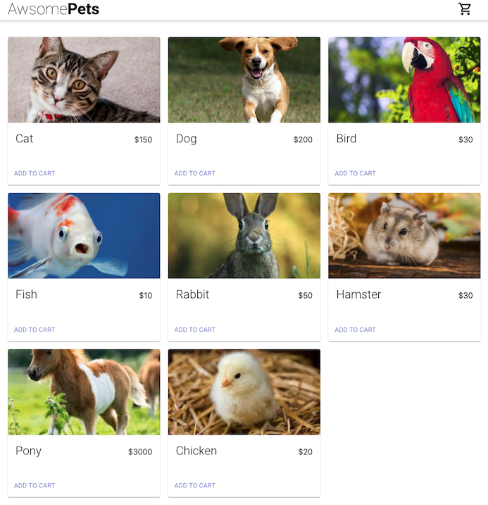
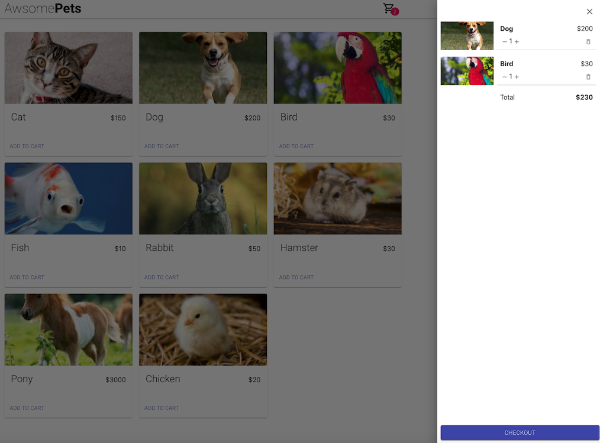
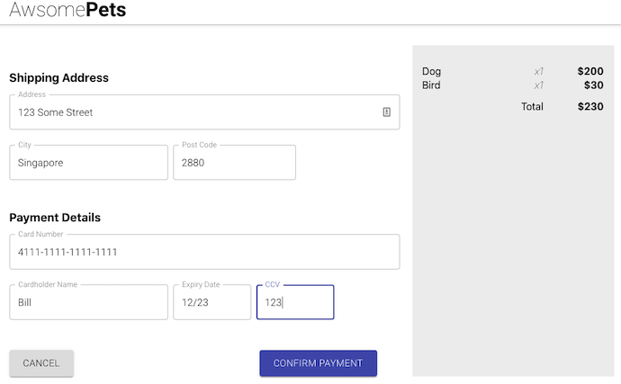
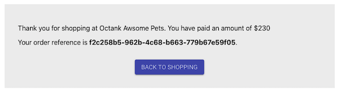

# AWSomePets S3 웹 호스팅 설치

AWSomePets 애플리케이션을 탐색해 보겠습니다.

## AWSomePets

1. AWSomePets S3 웹 호스팅 설치#단계 8의 SAM 출력에서 OriginURL 키의 값을 선택합니다. 브라우저 주소 표시줄에 입력하고 Enter를 클릭하여 웹 애플리케이션으로 이동합니다.
```bash
   i.e. https://xxxx.cloudfront.net
```

이제 다음 페이지가 표시됩니다.<br>


2. 장바구니에 몇 마리의 애완동물을 추가하고 장바구니 아이콘을 클릭합니다. 그런 다음 CHECKOUT 버튼을 클릭합니다.<br>


3. 아래와 같은 예시를 참고하여 ```Payment Details``` 섹션을 채운 다음 ```CONFIRM PAYMENT``` 버튼을 클릭합니다.<br>


4. 결제는 확인하는 데 시간이 걸리며 주문이 성공하면 확인 화면이 표시됩니다.



---

## [[이전]](3-install-s3-hosting.md) | [[다음]](5-create-order-process.md)
