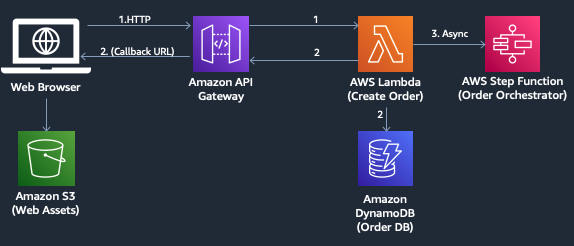

# 주문 프로세스 설

이제 결제 페이지에서 CONFIRM PAYMENT 버튼을 눌렀을 때 어떤 일이 일어나는지 살펴보겠습니다.<br>
웹 클라이언트는 ```endpoints.json``` 파일의 ```placeOrder``` 값에 구성한 REST API URL에 주문 세부 정보를 POST로 요청합니다. 그리고 이 REST API는 Amazon API Gateway에서 관리하고 요청을 백엔드로 전달하게 됩니다.




---

## [[이전]](4-navigate-awsomepets-application.md) | [[다음]](5.1-create-order-rest-api.md) 
