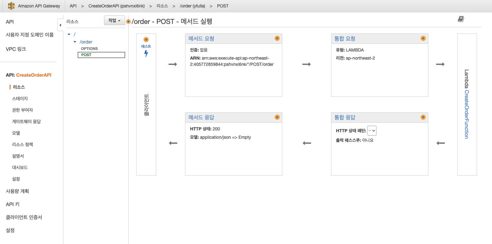
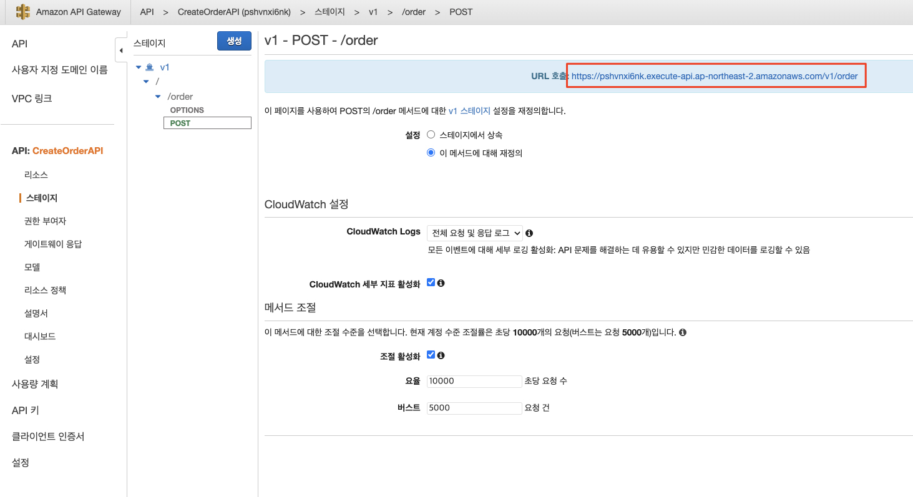

# 주문 생성 REST API

## API Gateway REST API

1. AWS 콘솔에서 API Gateway 서비스로 이동합니다.

2. API 섹션에서 CreateOrderAPI를 클릭합니다.<br>


3. 리소스 섹션을 클릭한 다음 ```/order/POST``` 경로를 봅니다. 이는 쇼핑 사이트에서 주문을 제출할 때 API의 메서드 실행 경로에 대한 정의입니다. 제출 시 API 게이트웨이는 CreateOrderFunction Lambda를 실행합니다.<br>



> **(참고)**<br>
> 해당 REST API는 Lambda 함수와의 비프록시 통합으로 구성됩니다. 비 프록시 통합 설정을 사용하면 API의 메서드 요청 데이터 (컨텍스트, 단계 또는 유틸리티 변수에 저장된 다른 데이터 포함)에서 해당 통합 요청 매개 변수로의 데이터 매핑과, 그리고 통합 응답 데이터에서 메서드 응답으로의 데이터 매핑이 가능합니다. API Gateway는 VTL(Velocity Template Language) 엔진을 사용하여 통합 요청 및 통합 응답에 대한 본문 매핑 템플릿을 처리합니다. 이 예에서는 생성된 데이터 매핑이 없지만 나중에 추가할 수 있습니다.

4. 왼쪽 창에서 Stage 섹션을 클릭한 다음 ```v1\order\POST``` 경로를 봅니다. Invoke URL 설정이 endpoints.json 파일의 placeOrder 키에 구성된 것과 동일한 URL인지 확인합니다.<br>


5. 웹 프런트 엔드에서 CreateOrderAPI로 전송된 예제 JSON 페이로드는 아래와 같습니다.<br>
```json
{
  "basket": [
    {
      "id": "0d1b5d4d-1206-4462-842f-130a9545a08f",
      "quantity": 1,
      "title": "Cat"
    },
    {
      "id": "417e0721-4317-41a6-bb57-54646ace9a0b",
      "quantity": 2,
      "title": "Dog"
    }
  ],
  "shippingAddress": {
    "address": "1 Some Street",
    "city": "Somewhere",
    "postCode": "1234"
  },
  "paymentDetail": {
    "cardNumber": "4111111111111111",
    "cardholderName": "Test Person",
    "expiry": "12/22",
    "ccv": "123"
  }
}
```

---

## [[이전]](5-create-order-process.md) | [[다음]](5.2-CreateOrderFunction-lambda.md)
