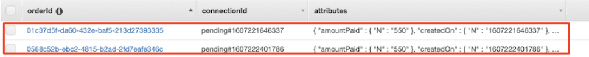

# 콜백 마이크로서비스 살펴보기

이전 섹션에서 우리는 ```CreateOrderFunction``` Lambda가 아래 JSON 페이로드에서 웹 소켓 클라이언트 콜백 URL을 반환했음을 확인했습니다. AWSomePets 웹 애플리케이션은 이 URL의 웹 소켓 연결을 열어 주문 상태에 대한 업데이트를 수신합니다.
```json
{
    "statusCode": 202,
    "status": "placed",
    "orderId": "9bd8b084-2d20-4ca4-85dc-801f32f59d91",
    "clientCallbackUrl": "wss://vbbkd3me87.execute-api.ap-northeast-2.amazonaws.com/v1?orderId=9bd8b084-2d20-4ca4-85dc-801f32f59d91"
}
```

여기서 우리는 웹 소켓 연결이 API 게이트웨이에 의해 관리되는 방식을 살펴보고자 합니다. 앞서 살펴본 [API Gateway 웹 소켓 구성 설정](./2-configure-api-gateway-websocket.md)에서 웹 소켓 API의 경로 3개 중 2개를 구성했습니다. 경로의 세부 정보는 다음과 같습니다.<br>
* $connect - 웹 클라이언트가 웹 소켓 연결을 시작할 때 트리거됩니다.
* $disconnect - 웹 클라이언트가 웹 소켓 연결을 끊을 때 트리거됩니다.
* $default - 웹 클라이언트가 웹 소켓 연결에서 백엔드로 메시지를 보낼 때 트리거됩니다.

## 웹 소켓 Lambda 함수

1. AWS 콘솔에서 Lambda 서비스로 이동합니다.

2. ```OrderWSConnectFunction``` Lambda로 이동하여 살펴봅니다. 코드를 보려면 ```index.js``` 파일을 클릭하십시오. 이 함수는 웹 소켓 연결 시 OrderCallbackAPI의 ```$connect``` 경로에 의해 트리거됩니다.

3. ```OrderWSConnectFunction``` Lambda는 다음 작업을 수행합니다.<br>
   * 웹 소켓 URL 요청으로부터 ```주문 ID (Order Id)``` 및 ```연결 컨텍스트 (Connection Context)```를 추출합니다.
   * ClientCallbackTbl DynamoDB 테이블에 ```orderId```와 ```ConnectionId```를 연결하는 레코드를 삽입합니다.
   
    ```javascript
      // Retrieve the order id and connection context from the query parameter
      const orderId = event.queryStringParameters.orderId;
      const domainName = event.requestContext.domainName;
      const stage = event.requestContext.stage;
      const connectionId = event.requestContext.connectionId;
    ```

4. 이후 섹션에서 ```OrderWSCallbackFunction``` Lambda가 이 레코드를 사용하여 웹 소켓 연결을 통해 상태 변화를 웹 클라이언트로 반환하는 방법을 살펴봅니다.

5. ```OrderWSDisconnectFunction``` Lambda로 이동하여 살펴봅니다. 코드를 보려면 index.js 파일을 클릭하십시오. 이 함수는 웹 소켓 연결 종료 시 ```OrderCallbackAPI```의 $disconnect 경로에 의해 트리거됩니다.

6. OrderWSDisconnectFunction Lambda는 ClientCallbackTbl DynamoDB 테이블에서 연결 ID가 있는 모든 레코드를 삭제하여 웹 클라이언트가 이전에 제출한 주문 상태 업데이트를 구독 취소합니다. 웹 소켓 연결이 종료되므로 웹 클라이언트는 더 이상 백엔드에서 주문 상태 업데이트가 필요하지 않습니다.

    ```javascript
        // Delete the connection
        for(let i=0; i<result.Items.length; i++) {
          let item = result.Items[i];
          const dParams = {
            TableName: clientCallbackTable,
            Key: {
              orderId: item.orderId,
              connectionId: item.connectionId
            }
          };
          .....
          await ddb.delete(dParams).promise();
    ```
7. OrderWSPendingFunction Lambda로 이동하여 살펴봅니다. 코드를 보려면 index.js 파일을 클릭하십시오. 이 함수는 웹 클라이언트가 웹 소켓 연결에 메시지를 보낼 때마다 OrderCallbackAPI의 $default 경로에 의해 트리거됩니다.

8. 이 OrderWSPendingFunction Lambda는 웹 클라이언트 ConnectionId가 등록되지 않은, 즉, 보류 중인 주문 상태 메시지를 확인합니다. 이는 주문 프로세스가 완료된 후 웹 클라이언트가 웹 소켓 연결을 설정할 때 드물게 발생합니다. 이전에 전송되지 않은 주문 있는 경우 OrderWSPendingFunction Lambda는 클라이언트에 대한 웹 소켓 연결을 통해 주문 상태를 반환합니다.<br>


[//]: # (![DynamoDB ClientCallbackTbl Pending]&#40;assets/ddb-clientcallbacktbl-pending-ko-kr.png&#41;)

---

## [[이전]](5.2-CreateOrderFunction-lambda.md) | [[다음]](7-explore-step-functions.md)
