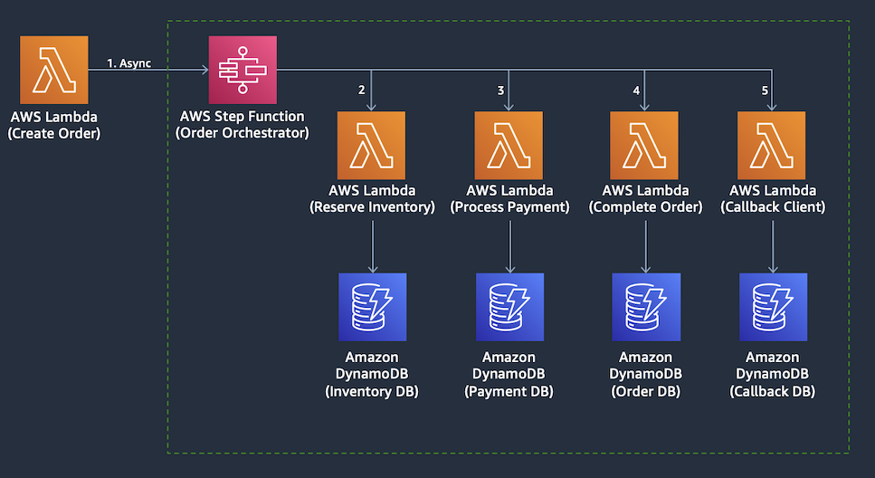

# AWS Step Functions 살펴보기

이번에는 ```OrderOrchestrator``` Step Functions를 살펴보겠습니다. OrderOrchestrator는 CreateOrderFunction Lambda에 의해 트리거되며 AWS Lambda 함수 시퀀스를 오케스트레이션하여 분산된 마이크로 서비스에서 주문 트랜잭션을 관리합니다. AWS Step Functions은 마이크로 서비스에서 분산 트랜잭션을 관리하기 위한 Saga Orchestration 패턴을 구현하는 데 사용됩니다.



---

## [[이전]](6-explore-callback-microservices.md) | [[다음]](7.1-aws-step-functions-success-transaction-flow.md)
