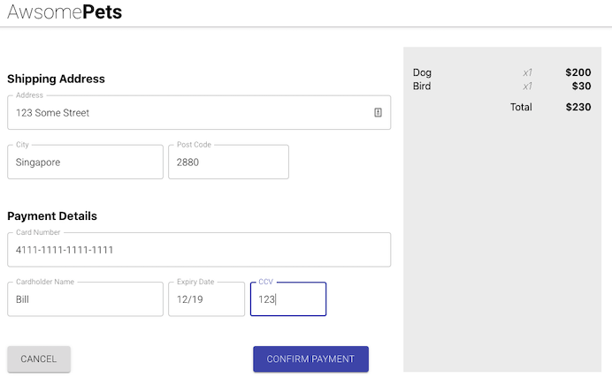
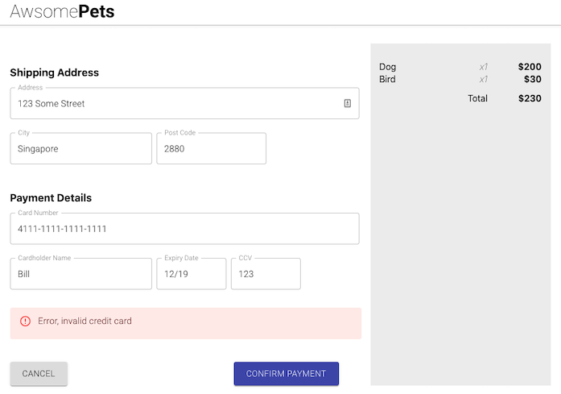
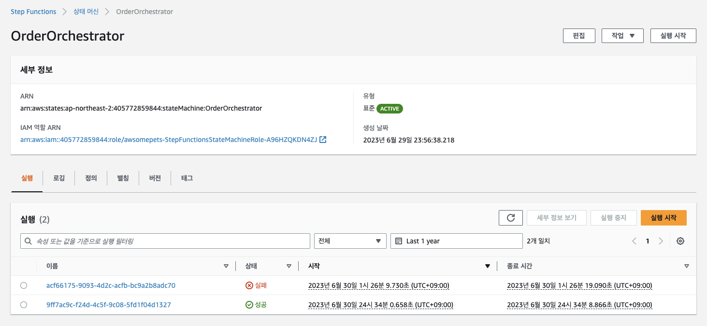
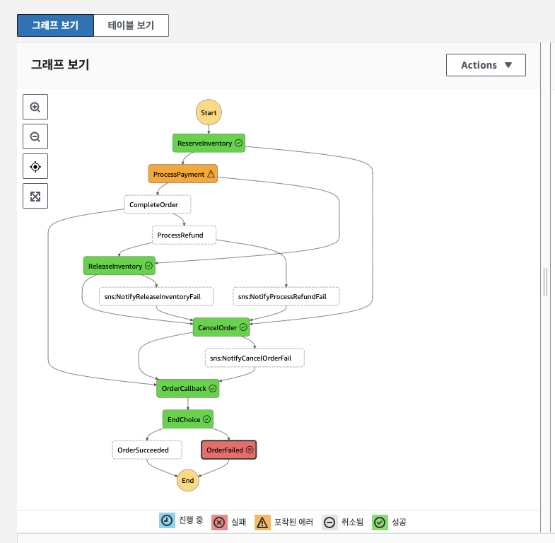
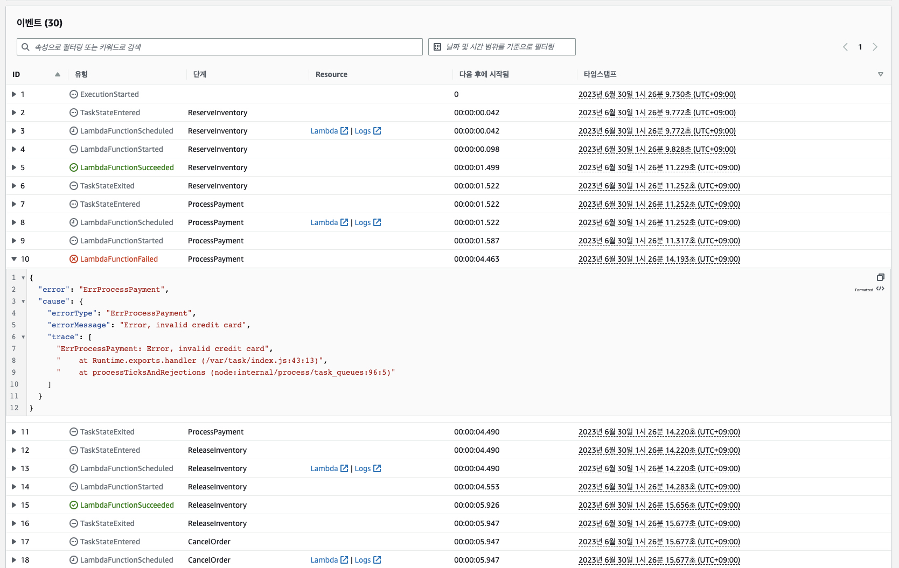

# AWS STEP FUNCTION - 보상 트랜잭션 흐름

이제 실패한 트랜잭션을 시뮬레이션하고 AWS Step Function 실행 경로를 살펴보겠습니다. <u>**보상 트랜잭션이 실행되어 로컬 트랜잭션 이전의 상태를 되돌리는 것**</u>을 볼 수 있습니다. Saga 패턴의 목표는 분산 트랜잭션 시나리오에서 마이크로 서비스 간에 데이터 일관성을 관리하는 것입니다. Saga 시퀀스 내에서 단계가 실패하면 Saga는 이전 트랜잭션에 대응하는 보상 트랜잭션을 실행하여 Saga 시퀀스 이전의 애플리케이션 상태를 복원합니다.

1. 브라우저 탭에서 AWSomePets 웹 페이지의 기본 페이지로 돌아가 다시 애완 동물 몇 마리를 구입한 다음 CHECKOUT을 클릭하여 결제 페이지로 이동합니다.

2. 결제 페이지에서 아래에 신용 카드 세부 정보를 입력하십시오. 결제 과정을 실패시키기 위해 입력한 신용 카드 만료 날짜가 과거(예: 12/19)인지 확인하십시오.<br>


3. 결제를 완료하면 유효하지 않은 신용 카드에 대한 오류 메시지가 표시됩니다.<br>


4. 브라우저 탭에서 Step Functions 콘솔을 다시 클릭하고 OrderOrchestrator 페이지로 다시 이동합니다; ```Step Functions > State machine > OrderOrchestrator```

5. 실행 섹션에서 실패 상태인 최신 트랜잭션을 클릭합니다.<br>


6. ```그래포 보기 (Graph Inspector)```로 이동하고 확장하여 프로세스 실행 그래프를 봅니다.<br>


7. 실패 경로 실행 작업이 다음과 같은 것을 볼 수 있습니다. ```ReserveInventory > ProcessPayment > ReleaseInventory > CancelOrder > OrderCallback > EndChoice > OrderFailed```. Step Function의 실행된 작업에 대한 세부 정보는 다음과 같습니다.<br>
   * ReserveInventory - ReserveInventoryFunction Lambda를 실행하여 주문한 항목에 대한 재고를 예약합니다.
   * ProcessPayment - ProcessPaymentFunction Lambda를 실행하여 신용 카드 결제를 처리합니다. 이 경우 신용 카드 만료로 인해 결제에 실패했으며 OrderOrchestrator에 오류가 반환되었습니다.
   * ReleaseInventory - ReleaseInventoryFunction Lambda를 실행하여 이전에 예약된 항목의 인벤토리를 해제합니다. 이 Lambda 함수는 보상 트랜잭션을 실행하여 주문 트랜잭션이 실패했을 때 재고 상태를 되돌립니다.
   * CancelOrder - CancelOrderFunction Lambda를 실행하여 DynamoDB 테이블 및 메시지 JSON에서 주문을 취소된 것으로 표시합니다.
   * OrderCallback - OrderWSCallbackFunction Lambda를 실행하여 웹 소켓 연결을 통해 주문 상태 실패에 대해 웹 클라이언트를 업데이트합니다.
   * EndChoice - JSON 메시지의 상태 필드에 따라 프로세스를 성공 또는 실패로 표시하는 선택 작업입니다.
   * OrderFailed - 프로세스를 '실패'로 표시하는 작업입니다.

8. ```Execution event history``` 섹션까지 아래로 스크롤하여 'Succeeded' 트랜잭션과 JSON 메시지 처리를 비교합니다.




---

## [[이전]](7.1-aws-step-functions-success-transaction-flow.md) | [[다음]](8-explore-websocket-callback.md)
