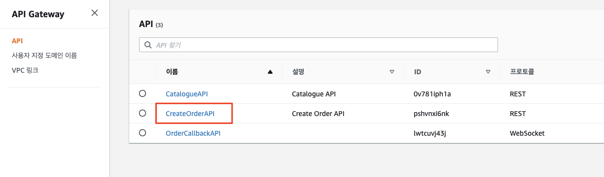
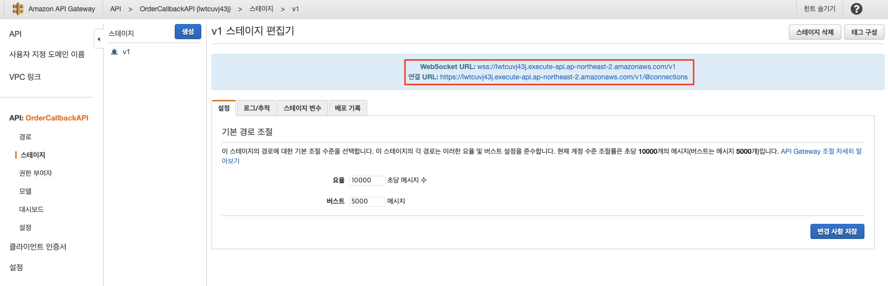

# API 게이트웨이 웹 소켓 API 살펴보기

1. AWS 콘솔에서 API Gateway 서비스로 이동하고 API 섹션에서 OrderCallbackAPI를 클릭합니다.


2. ```단계 (Stages)``` 섹션으로 이동한 다음 v1 단계를 클릭하여 배포 단계를 봅니다; ```API > OrderCallbackAPI > 단계 (Stages) > v1```. API Gateway 웹 API는 양방향입니다. 클라이언트는 서비스에 메시지를 보낼 수 있고 서비스는 독립적으로 클라이언트에 메시지를 보낼 수 있습니다. ```Websocket URL```은 AWSomePets 웹 애플리케이션이 메시지를 보내고 업데이트를 받기 위해 연결하는 URL입니다. ```연결 URL```은 웹 클라이언트로 메시지를 다시 보내기 위해 HTTP를 통해 AWS가 POST 메시지를 서비스하는 URL입니다.<br>


---

## [[이전]](8-explore-websocket-callback.md) | [[다음]](8.2-explore-websocket-callback-lambda-function.md)
